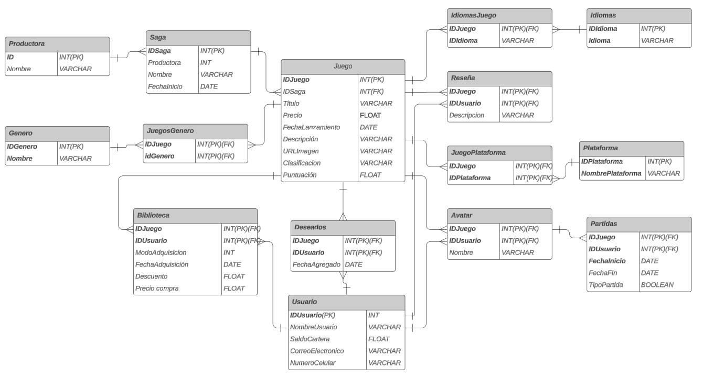
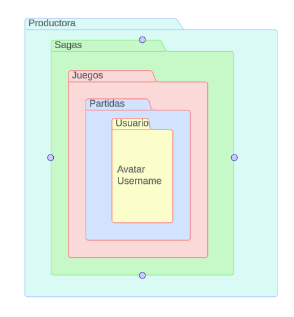
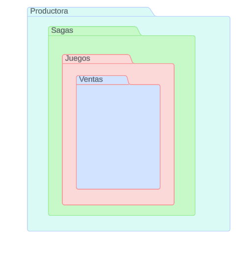
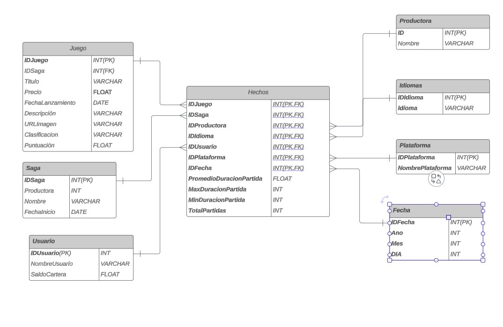
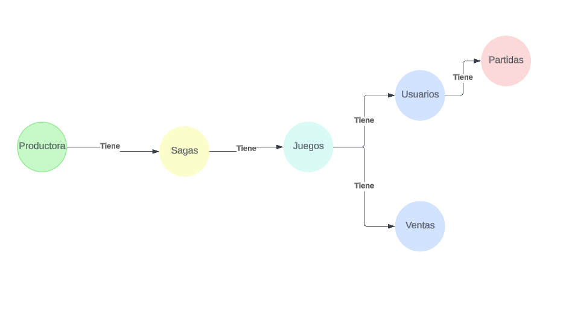
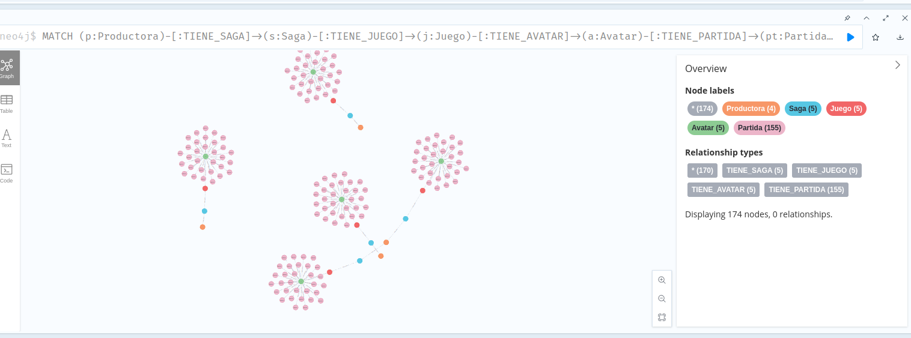

# Game Plataform

Nowadays exist several option for a database model. We have seen multiple paradigms, the most known are documents or graps. Most of them offer a new way not only to store data but visualize, retrive and modeling. Despite all the texts supporting this databases, there are few real test or comparisons with the traditional relational model. 

The main porpuse of ths repository will be the comparisons and performance test of these databases. The starting point will be the relational model, where then we will make the data transformation to fit the other models, of corse taking into acount the difference and necesities of each database.

## Inspiration

The idea of the subject came from the well known videogames plataforms duch as Steam, Epic Games, etc. This plataforms are intended to sell, videogames and collect data from the users, thats why the desition of this subject. 

The next poins then will be based on these plataforms, creating our own to allow us to modelate the data given the database.

## The relational model

For the relational model we needed a big
transactional table, one such that its registers could araise up to $2,000,000$. 
For the sake of  such objective  we added 
a 'Matches'(Partidas) table, where we could
store the matches player of a gamer. Even though, our inspiration does not include or do not keep track of that data.

With that in mind we were able to achive a solid and perfect relational model. Here we present the ER diagram.

This is our starting point to create the other databases, the only point still missing is the data itself. 

### Generating the data

The registers for some tables like "Juego", "Productora", etc. come from real data, since it is easy to get such information on internet, for the next tables we had no information, so we had to generate them based on:

* Some random data asked to [ChatGPT4o](https://chatgpt.com/)

* Random numbers, for example the duration of the Matches $\sim Pareto(\alpha, x_m)$. 

Then we generated the data with python in a notebook and we could start the transformations for comparig with the other databases.

## The document-based model

The main porpuse for this model was to visualize how it is possible to embbed the documents just like a json. In order of creating a fair model for comparison, we created a model where the embbedings start from "Productora" and ends in "Partidas" wich is represented in the next diagram.

In addition to that model, it was decidded to create another more useful in a real proble, instead of embeeding all the matches, the sales that were taken from the table of "Biblioteca"/

The transformation of the thata was made in another notebook ans writen into a json file an then loaded into MongoDb

## The columnar model

In the case of the columnar database, we wanted to achive a more real-life databse. Furthermore, the database had to be able to inject data into a dshbord. 
As we know, a dhasbord should be made for reading primarly  KPI's. Since we were basing most of our databases models in the matches, we ttok as or most important KPI, the duration of the match and metrics derived from that.

The diagram was thoght as a star just like an OLAP, following the next diagram:

The choosen database was Google BigQuery.

The dashboard can be acceced throught the next link: [Link](https://gameplataform-fm7rv9cpddqznjdiycgkmy.streamlit.app/)

## The graph-based model

Our final model was the graph based, were smilarly from the document-based, the main porpuse of the model was to measure the performance with the regular relational model.
The diagram is really similar to the document-based, however in this case we did not have to sparate the data in two collection (graphs in thsi specific case) because of the flexiblity of the graph model.

The resultant diagram is the next:

Here we can see the data using a cypher query to retrive all the 
structure, from te first to the las node, we can see al the groups.

## Results
In this example, we'll explore queries executed in three distinct database architectures: Online Transaction Processing (OLTP), Online Analytical Processing (OLAP), and Columnar (Big Query). By examining the execution times across these architectures, we aim to gain insights into their respective efficiencies and performance characteristics.

OLTP

OLAP

Big Query

## Important links

* All the diagrams: [LucidChart](https://lucid.app/lucidchart/39fb04d9-5657-41fc-99ce-ea45582cac2f/edit?view_items=pV6HX5HtD7gN&invitationId=inv_2f4114a2-44a8-4965-a86f-53c101ce50cd)

* The data: [GoogleDrive](https://drive.google.com/drive/folders/19umbaGA_sQExJP1HnsQT05GSxlaA7H0b?usp=sharing)

* Dashboard: [StreamIt](https://gameplataform-fm7rv9cpddqznjdiycgkmy.streamlit.app/)

